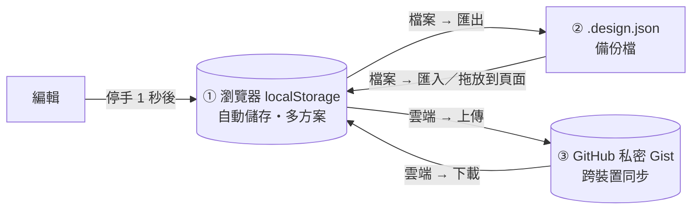
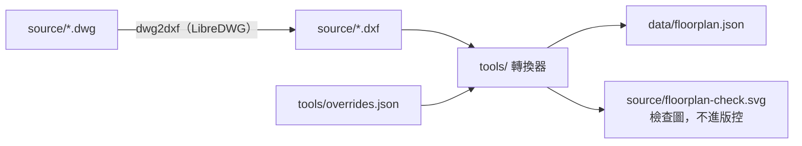

# 平面圖 3D 室內設計工具

把住家室內平面圖轉成 3D 空間，在網頁上拖拉擺放 3D 家具，並儲存、管理多個設計方案。

- 純靜態網站：HTML ＋ CSS ＋ 原生 JavaScript（ES modules），不需要建置步驟
- 3D 引擎：[Three.js](https://threejs.org/) 0.186.1，從 CDN 以 import map 載入
- 手機可以瀏覽、旋轉視角、切換方案；拖拉擺放建議用電腦

## 功能

- [x] DWG → DXF → `data/floorplan.json` 轉換
- [x] 3D 空間建模：牆體擠出、門窗開口、各房間地板顏色、樓高可調
- [x] 視角：3D 環繞、正上方俯視、第一人稱漫遊（WASD ＋ 滑鼠）
- [x] 13 種程式化低多邊形家具，尺寸與顏色可改，預留外部 GLB／GLTF 模型
- [x] 拖拉擺放、旋轉、刪除、複製、網格對齊、撞牆檢查、重疊警示、牆距、復原／重做
- [x] 設計儲存：瀏覽器自動儲存、多方案管理、匯出／匯入、PNG／GLB 匯出、GitHub Gist 雲端同步

## 本機執行

瀏覽器不允許從 `file://` 載入 ES modules，要用本機伺服器開啟：

```bash
python3 -m http.server 8000
```

然後打開 <http://localhost:8000>。

## 操作方式

| 想做的事 | 操作 |
| --- | --- |
| 新增家具 | 左側「家具」拖進畫面；或點一下，放到畫面中央附近的空位 |
| 移動家具 | 按住家具在地板上拖曳；碰到牆會停在牆前 |
| 旋轉 | `R` 順時針 15°、`Shift`＋`R` 逆時針；或右側面板的 ⟳ ⟲ |
| 刪除／複製 | `Delete`／`Ctrl`＋`D`；或右側面板的按鈕 |
| 改尺寸、顏色 | 選取家具後在右側面板修改（公分） |
| 復原／重做 | `Ctrl`＋`Z`／`Ctrl`＋`Y`（Mac 用 `⌘`） |
| 取消選取 | `Esc` 或點空白處 |
| 轉動、縮放視角 | 滑鼠左鍵拖曳旋轉、滾輪縮放、右鍵平移；手機用手指 |
| 第一人稱漫遊 | 點「漫遊」再點畫面；`W A S D` 移動、滑鼠轉頭、`Esc` 離開 |
| 看清楚家具配置 | 左下「剖面」把牆降到 1.1 公尺 |
| 對齊網格 | 左下「對齊網格 5 cm」可開關 |
| 地板顏色、樓高 | 左側「地板」 |

紅色外框代表與其他家具重疊（地毯除外）；右側面板會顯示到最近牆面的距離。

## 儲存機制



| 層 | 存在哪 | 什麼時候會不見 | 用途 |
| --- | --- | --- | --- |
| ① 自動儲存 | 這個瀏覽器的 localStorage | 清除瀏覽器資料、換瀏覽器或電腦 | 日常編輯，重新整理不會遺失 |
| ② 設計檔 | 你下載的 `.design.json` | 自己刪掉才會不見 | 備份、搬家；`.gitignore` 已排除，不會被誤傳到 repo |
| ③ 雲端 | 你 GitHub 帳號下的**私密** Gist | 自己刪掉才會不見 | 換電腦、手機也能下載同一份設計 |

- **多方案**：頂部選單切換；「＋ ✎ ⧉ 🗑」分別是新增、重新命名、複製、刪除。
- **容量不足**：localStorage 約 5 MB，一個方案通常不到 20 KB。真的滿了會跳出提示，請先匯出全部方案。
- **匯入時名稱重複**：會詢問要覆蓋原本的，還是另存成新方案。格式錯誤的方案會列出哪個欄位錯，不會讓頁面壞掉。
- **雲端版本衝突**：以修改時間比較；雲端比較新時上傳會先詢問，下載時也會讓你選保留哪一版。
- **格式改版**：設計檔帶 `schemaVersion`，舊檔讀取時會自動升級到新格式（`js/storage/schema.js` 的 `MIGRATIONS`）。

## 建立只有 Gist 權限的 GitHub Token

雲端同步需要一組只能讀寫 Gist 的 Token。**Token 只存在你的瀏覽器**，不會寫進程式碼或 repo。

1. 登入 GitHub，右上角頭像 → **Settings**
2. 左側最下面 **Developer settings** → **Personal access tokens** → **Fine-grained tokens**
3. **Generate new token**
   - **Token name**：例如 `floorplan-3d gist`
   - **Expiration**：建議 90 天，到期再重建
   - **Repository access**：選 **Public repositories**（這組 Token 不需要碰任何 repo）
   - **Permissions** → **Account permissions** → **Gists** 設為 **Read and write**
   - 其他權限都保持 **No access**
4. **Generate token**，複製 `github_pat_` 開頭的字串
5. 回到網頁左側「雲端」，貼上後按「儲存 Token」

不用時按「清除 Token」即可；也可以到 GitHub 同一頁把 Token 刪除。所有方案會放在同一個私密 Gist（描述為「floorplan-3d 設計方案…」），請不要手動改它的描述。

## 平面圖轉換



需要 `brew install libredwg` 與 [uv](https://docs.astral.sh/uv/)。

```bash
dwg2dxf -y -o source/plan.dxf source/plan.dwg
cd tools && uv run dxf-to-floorplan ../source/plan.dxf \
  --overrides overrides.json --out ../data/floorplan.json --preview ../source/floorplan-check.svg
```

`tools/overrides.json` 放圖面上讀不出來、要人工指定的設定：

| 欄位 | 單位 | 用途 |
| --- | --- | --- |
| `unitScale` | — | 圖面單位換成公尺的倍率（圖面是 cm 就填 `0.01`） |
| `clip` | 圖面單位 | 同一張圖畫了好幾份時，只取這個範圍內的那份 |
| `layers` | — | 哪些圖層是 RC 牆、隔間、柱、窗、門、欄杆 |
| `windowTypes` | 公尺 | 各窗編號的窗台（`sill`）與窗頂（`head`）高度 |
| `doorHead`／`doorwayHead` | 公尺 | 門、門洞的上緣高度 |
| `gapMin`／`gapMax` | 圖面單位 | 牆與牆之間多寬才算開口 |
| `rooms` | 圖面單位 | 房間名稱與種子點（房間內任一點），地板範圍由此往外填 |
| `ignoreOpenings` | — | 誤判的開口 id，列在這裡就不輸出 |

`floorplan.json` 座標單位公尺、y 軸朝上；**不含任何圖面文字**，門窗編號只接受 `W5`、`FD2` 這類代號。

## 換成真實的家具模型

家具預設是程式產生的幾何體。要換成 GLB／GLTF 模型，在 `js/main.js` 開頭註冊即可，模型會自動縮放到家具設定的寬深高、底部貼地：

```js
import { registerExternalModel } from './furniture/models.js';
registerExternalModel('sofa', 'models/sofa.glb');
```

模型正面請朝 +Z；載入失敗時會自動改回程式化模型。

## 測試

```bash
npm test
```

（網頁邏輯：幾何、碰撞、儲存、遷移、匯入匯出、Gist；不需要安裝任何套件，Node 20 以上即可）

```bash
cd tools && uv run pytest
```

（平面圖轉換器）

## 專案結構

```
index.html          入口
css/app.css
data/floorplan.json 平面圖資料（由 tools/ 產生）
js/
├── main.js         把各模組串起來
├── app/            設計狀態（復原／重做）、方案管理
├── core/           平面圖量體、2D 幾何、擺放規則（不依賴 Three.js）
├── furniture/      家具目錄與 3D 模型
├── interact/       拖曳、選取、快捷鍵
├── scene/          Three.js 場景、視角、匯出
├── storage/        設計檔格式、localStorage、匯出入、Gist
└── ui/             側欄、面板、對話框
tests/js/           node --test
tools/              DXF → floorplan.json 轉換器（Python）
source/             原始 DWG／DXF（不進版控）
```

## 隱私

- `source/`（原始 DWG／DXF）與 `*.design.json` 已列入 `.gitignore`，不會上傳
- `data/floorplan.json` 只有牆、門窗、房間的座標，不含地址、檔名、圖框文字
- 網頁加上 `noindex, nofollow`，不讓搜尋引擎收錄
- GitHub Token 只存在瀏覽器 localStorage；雲端 Gist 一律建立為私密
