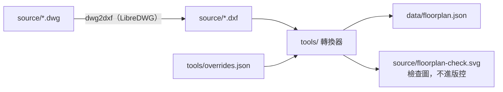

# 平面圖 3D 室內設計工具

讀入室內平面圖，產生 3D 空間，在網頁上拖拉擺放家具，並儲存、管理多個設計方案。

> 開發中，以下章節會隨各階段補齊。

## 功能

- [x] DWG → DXF → `data/floorplan.json` 轉換
- [ ] 3D 空間建模（牆體、門窗開口、地板）
- [ ] 程式化家具庫
- [ ] 拖拉擺放、旋轉、碰撞檢查、復原／重做
- [ ] 設計儲存：瀏覽器自動儲存、匯出／匯入、GitHub Gist 雲端同步

## 平面圖轉換



需要 `brew install libredwg` 與 [uv](https://docs.astral.sh/uv/)。

```bash
dwg2dxf -y -o source/plan.dxf source/plan.dwg
cd tools && uv run dxf-to-floorplan ../source/plan.dxf \
  --overrides overrides.json --out ../data/floorplan.json --preview ../source/floorplan-check.svg
```

`tools/overrides.json` 放圖面上讀不出來、要人工指定的設定：

| 欄位 | 單位 | 用途 |
| --- | --- | --- |
| `unitScale` | — | 圖面單位換成公尺的倍率（圖面是 cm 就填 `0.01`） |
| `clip` | 圖面單位 | 同一張圖畫了好幾份時，只取這個範圍內的那份 |
| `layers` | — | 哪些圖層是 RC 牆、隔間、柱、窗、門、欄杆 |
| `windowTypes` | 公尺 | 各窗編號的窗台（`sill`）與窗頂（`head`）高度 |
| `doorHead`／`doorwayHead` | 公尺 | 門、門洞的上緣高度 |
| `gapMin`／`gapMax` | 圖面單位 | 牆與牆之間多寬才算開口 |
| `rooms` | 圖面單位 | 房間名稱與種子點（房間內任一點），地板範圍由此往外填 |
| `ignoreOpenings` | — | 誤判的開口 id，列在這裡就不輸出 |

`floorplan.json` 座標單位公尺、y 軸朝上；**不含任何圖面文字**，門窗編號只接受 `W5`、`FD2` 這類代號。

測試：`cd tools && uv run pytest`

## 本機執行

（待補）

## 操作方式

（待補）

## 儲存機制

（待補）

## 建立只有 Gist 權限的 GitHub Token

（待補）

## 隱私

- `source/`（原始 DWG/DXF）與 `*.design.json` 已列入 `.gitignore`，不會上傳
